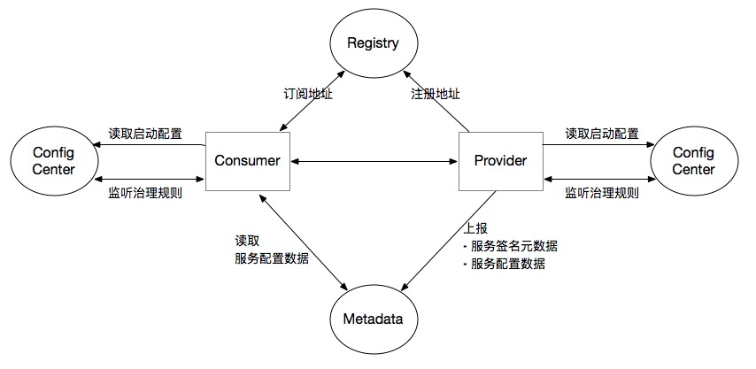
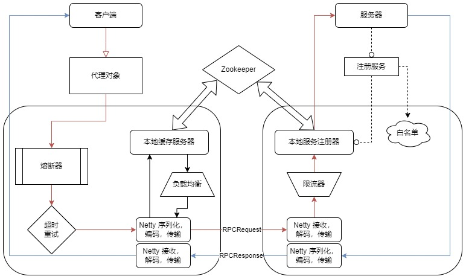

# 项目概述

仿照市场主流的RPC框架 Dubbo 的设计思想，使用java语言手动实现一个高性能，高可用性的RPC框架。

Dubbo 流程图

MyRPC 项目可以分为调用方（client）和提供方（server），client 端只需要调用接口即可，最终调用信息会通过网络传输到 server，server
通过解码后反射调用对应的方法，并将结果通过网络返回给 client。对于 client 端可以完全忽略网络的存在，就像调用本地方法一样调用
rpc 服务。

MyRPC 项目流程图

# V1

## 概述

服务端：

* 有一个User表

  UserServiceImpl 实现了UserService接口

  UserService里只有一个功能: getUserByUserId(Integer id)

客户端：

* 实现了两个功能

  传一个Id给服务端，服务端查询到User对象返回给客户端

  传递给一个User对象给服务端，服务端能够插入客户端传入的对象

1. 定义更加通用的消息格式：Request 与 Response 格式， 从此可能调用不同的方法，与返回各种类型的数据。
2. 使用了动态代理进行不同服务方法的Request的封装。
3. 客户端更加松耦合，不再与特定的Service，host，port绑定。

客户端发起一次请求调用，通过 SimpleRPCClient 的 Socket建立连接，发起请求Request，得到响应Response

## 存在的问题

1. 服务端只绑定了 UserService 服务，怎样完成多个服务的注册。
2. 服务端以BIO的方式性能低
3. 服务端功能太复杂：监听，处理。需要松耦合。

# V2 && V3

## 概述

1. 添加线程池版的服务端的实现
2. 功能上新增了 BlogService 服务
3. 服务端能够提供不同服务
4. 对客户端进行了重构，能够支持多种版本客户端的扩展
5. 使用 Netty 实现了客户端与服务端的通信

### 客户端和服务端重构

客户端发起一次请求调用，通过 ClientProxy 动态代理封装 request 对象，并使用 IOClient 进行数据传输

服务端通过 ServiceProvider 类进行本地服务的存放，使用类的方法进行服务注册（服务端注册服务）和获取本地实例（线程或者线程池得到相应服务实现类，再执行反射得到方法执行）

### 使用 Netty 时

客户端发起一次请求调用，通过传入不同的client(simple,netty)，即可调用公共的接口sendRequest发送请求

服务端的 netty 服务线程组 boss 负责建立连接， work 负责具体的请求

## 存在的问题

只是通过 pipeline.addLast(new LengthFieldBasedFrameDecoder(Integer.MAX_VALUE,0,4,0,4)); 规定了消息格式是 [长度][消息体],
用以解决粘包问题

但是使用的 java 自带序列化方式不够通用，不够高效

# V4 && V5

## 概述

1. 增加了 ObjectSerializer 与 JsonSerializer 两种序列化器
2. 引入 zookeeper 作为注册中心管理 ip 和 port
3. 新增随机和轮询两种负载均衡策略

### 序列化

自定义传输格式和编解码为

[消息类型 2Byte 序列化方式 2Byte 消息长度 4Byte 序列化字节数组 byte[length]]

对应

[writeShort writeShort writeInt writeBytes]

客户端和服务端都通过 bootstrap 启动时配置相应的 NettyInitializer，调用 pipeline.addLast 配置netty对消息的处理机制，比如
JSON 等序列化

### 引入 zookeeper

客户端不需要指定相应的 ip 和 port, 在发送请求时，直接通过 serviceRegister 从注册中心获取host，port 发送请求

服务端需要通过 ServiceProvider 类进行本地服务的存放时，还需要使用 serviceRegister 把自己的ip，端口给注册中心

## 存在的问题

调用方每次调用服务，都要去注册中心zookeeper中查找地址，性能较差

# V6

## 概述

1. 在客户端建立一个本地缓存，缓存服务地址信息
2. 通过在注册中心注册Watcher，监听注册中心的变化，实现**本地缓存的动态更新**

# V7

## 概述

1. 将 ZooKeeper 的客户端和服务端逻辑拆分，ZkServiceRegister 类负责服务注册（服务端逻辑），ZkServiceCenter 负责服务发现（客户端逻辑）
2. 使用 Guava Retry 实现超时重试
3. 为了防止插入数据之类的操作重试，设置白名单，使得对幂等服务才进行超时重试，白名单存放在 ZK 中（充当配置中心的角色）

# V8 && V9

## 概述

1. 增加限流功能，使用令牌桶算法作为限流算法
2. 为了防止被调用的服务出现问题，而影响到作为调用端的服务，建立 CircuitBreaker 类实现熔断器逻辑

# 项目总结

核心功能实现主要有服务寻址、序列化和反序列化、网络传输。

## 服务寻址

在本地方法调用中，函数体是直接通过函数指针来指定的，但是在远程调用中，由于两个进程的地址空间完全不一样，函数指针不起作用。

RPC中所有函数或方法都有自己的一个ID，在所有进程中都唯一。客户端在做远程过程调用时，必须附上这个ID，即客户端会查一下表，找出相应的Call
ID，然后传给服务端，服务端也会查表，来确定客户端需要调用的函数，然后执行相应函数的代码。

在项目中，首先用本地 Map<String, Object>
存储服务，为了避免本机映射表的类型安全性差、可扩展性有限、存在单点故障等问题，使用在注册中心注册服务，注册中心具有集中管理（ZK节点注册）、高可用性（服务降级和熔断保护）和容错（超时重试）、负载均衡（可自己实现多种负载均衡算法）、自动发现（ZK的Watch机制）等优点。

为了客户端更快寻址而不用频繁访问ZK，还建立一个本地缓存，缓存服务地址信息。

## 序列化和反序列化

本地调用中，只需要将数据压入栈中，然后让函数去栈中读取即可。

远程的数据传输，由于客户端和服务端不在同一个服务器上，涉及不同的进程，不能通过内存传递参数，此时就需要将客户端先将请求参数转成字节流（编码），传递给服务端，服务端再将字节流转为自己可读取格式（解码），这就是序列化和反序列化的过程。反之，服务端返回值也逆向经历序列化和反序列化到客户端。

在项目中，使用了 Fastjson 作为序列化工具。

## 网络传输

客户端将Call ID和序列化后的参数字节流传输给服务端。

服务端将序列化后的调用结果回传给客户端。

基于TCP协议实现的RPC调用，由于是底层协议栈，更佳灵活的对协议字段进行定制，可减少网络开销，提高性能，实现更大的吞吐量和并发数。但底层复杂，实现代价高。

基于HTTP协议实现的RPC调用，已封装实现序列化，但HTTP属于应用层协议，HTTP传输所占用的字节数比TCP更高，传输效率对比TCP较低。

在项目中，采用自定义传输格式和编解码为 [消息类型 2Byte 序列化方式 2Byte 消息长度 4Byte 序列化字节数组 byte[length]]。
还使用了基于 NIO 的 Netty 提高网络传输性能。
